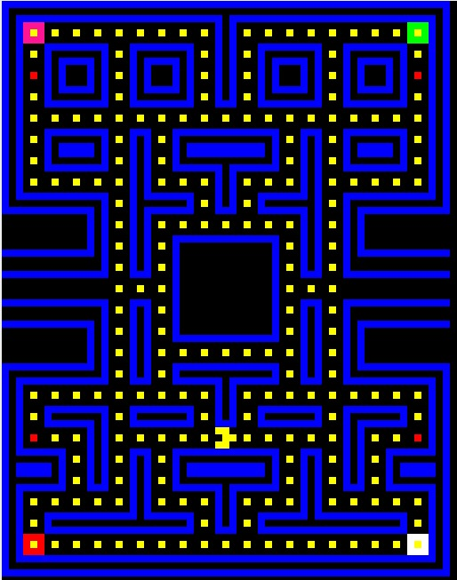

# PacMan-Mars
## Projeto
   
 PacMan desenvolvido em assembly MIPS/MARS, para a matéria de Arquitetura e Organização de Computadores (Unifesp-SJC). Video Apresentando o projeto https://www.youtube.com/watch?v=_7QjUG-Tr1s.
## MARS utilizado
O MARS utilizado no projeto é modificado afim de facilitar o uso do Bitmap Display, ele está disponivel no arquivo Material/Mars.zip (**Não sei quem foi o autor**).
## Como jogar
 Para a movimentação foram usadas as teclas w a s d, a tecla p pausa o jogo, após clicar em uma tecla de movimentação a pausa é retirada (Comandos utilizando o "KeyBoard and Display MMIO Simulator").  
 A configuração de Display ("Bitmap Display") foram:  
 * Inicio na memória 0x10040000(heap);  
 * Pixels (8x8);  
 * Tamanho da tela (512x1024)
